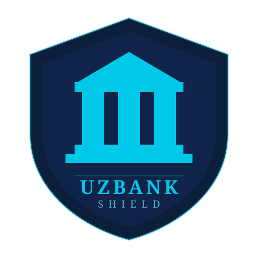

<div align="center">
  

  # UzBank Shield
</div>

UzBank Shield is an open-source Python project that analyzes URLs for common phishing indicators. The project is being developed to explore practical cybersecurity techniques while focusing on online banking safety in Uzbekistan.

Rather than trying to detect every type of cyber threat, the current goal is to identify suspicious banking-related URLs using simple and understandable detection methods. The project will gradually expand with more advanced security checks as development continues.

---

## Why this project?

Online banking scams have become increasingly common. Attackers often create fake websites that closely resemble legitimate bank pages in order to steal passwords, card details, and SMS verification codes.

UzBank Shield was started as a personal cybersecurity learning project with the long-term goal of helping users recognize suspicious banking websites before entering sensitive information.

---

## Current Features

Current version: **v1.0.0**

**Core Detection**
- URL parsing, validation, and phishing keyword detection
- Official bank and payment processor domain verification (Payme, Click, Uzcard, Humo)
- Typosquatting and suspicious TLD detection
- SSL, HTTPS, and WHOIS domain analysis
- Weighted risk scoring with actionable recommendations

**Interfaces**
- Terminal application with Rich-based reporting
- Desktop GUI (PySide6) with threaded scanning, scan history, and settings

**Platform**
- Multilingual support (English, Russian, Uzbek)
- Configurable settings with first-run setup
- Scan history and debug logging
- Modular, tested architecture (66+ unit tests)

## Installation

Clone the repository.

```bash
git clone https://github.com/Phlorenci/UzBank-Shield.git
```

Open the project.

```bash
cd UzBank-Shield
```

Create a virtual environment.

```bash
python -m venv .venv
```

Activate it.

Windows

```bash
.venv\Scripts\activate
```

Install dependencies.

```bash
python -m pip install -r requirements.txt
```

Run the application.

```bash
python detector.py
```

---

## Technologies

- Python 3
- Rich
- pytest
- difflib
- urllib.parse
- JSON

## Roadmap

## Documentation

-  [Roadmap](docs/roadmap.md)
-  [Architecture](docs/architecture.md)
-  [Changelog](docs/changelog.md)
-  [Database](docs/database.md)
-  [Contributing](docs/contributing.md)

---

### Future Development

Long-term plans include:

- Desktop application
- Telegram bot
- Browser extension
- Uzbek, Russian and English interface
- Payment Page Safety Checker
- Community Threat Database
- Anti-Scam Protection
---

## Disclaimer

UzBank Shield is an educational and research project.

Analysis results should not be considered professional security advice or a guarantee that a website is safe or malicious.

---

## Author

Bobur Mirzarakhimov

Computer Science Student

Sejong University

GitHub

https://github.com/Phlorenci

---

## License

MIT License