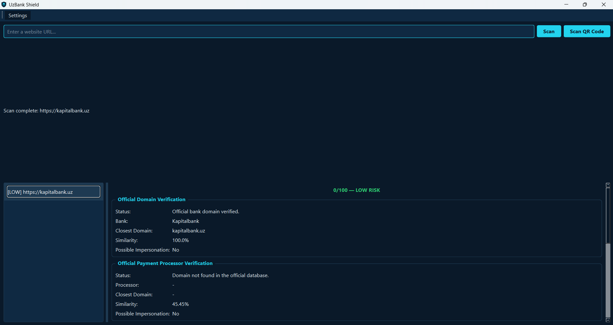
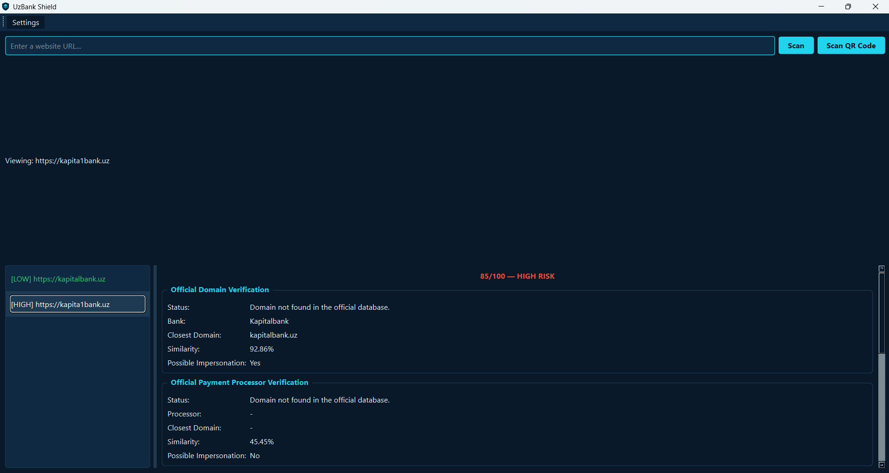
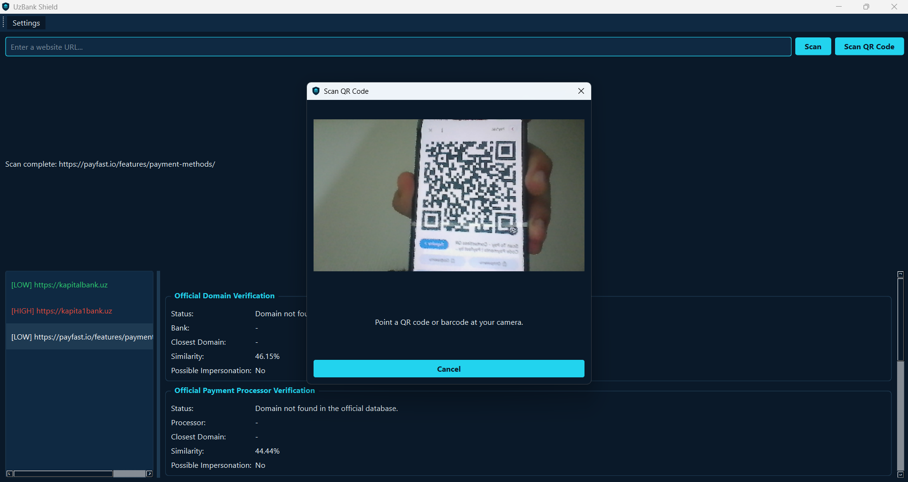
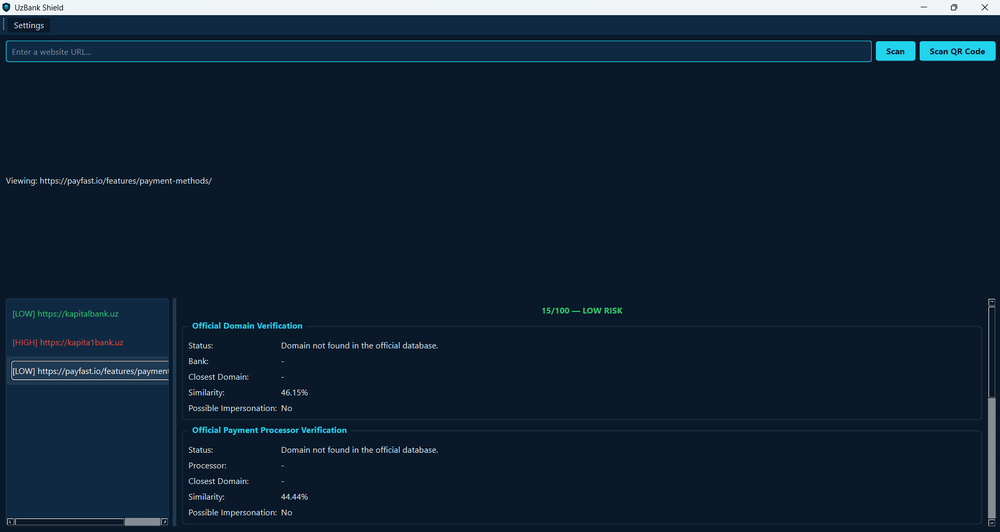

<div align="center">
  

  # UzBank Shield

  **Phishing detection for Uzbek banking and payment websites — terminal & desktop app**

  [](https://www.python.org/)
  [](docs/changelog.md)
  [](LICENSE)
  [](https://github.com/Phlorenci/UzBank-Shield/releases)
</div>

---

UzBank Shield detects phishing websites impersonating Uzbek banks and payment processors — verifying domains against the Central Bank of Uzbekistan's official registry, catching typosquatting, analyzing payment pages for card-stealing forms, and scanning QR codes for hidden threats. Available as both a terminal tool and a desktop app.

<div align="center">
  
</div>

### Catches real threats

<div align="center">
  
</div>

*A URL just one character off from a real bank domain, correctly flagged as likely impersonation.*

### QR code and barcode scanning

<div align="center">
  
  
</div>

Scans any QR code or barcode live via webcam — not just website links. Automatically classifies WiFi credentials, payment QR codes (Toss, Alipay, WeChat Pay-style EMV codes), contact cards, and crypto addresses, with a tailored safety assessment for each.

---

## Why this project?

Online banking scams have become increasingly common. Attackers often create fake websites that closely resemble legitimate bank pages in order to steal passwords, card details, and SMS verification codes.

UzBank Shield was started as a personal cybersecurity learning project with the long-term goal of helping users recognize suspicious banking websites before entering sensitive information. It's grown into a full detection engine covering domain verification, typosquatting, SSL/WHOIS analysis, payment page inspection, and QR code safety — all fully localized in English, Russian, and Uzbek.

---

## Current Features

Current version: **v1.2.0**

**Core Detection**
- URL parsing, validation, and phishing keyword detection
- Official bank and payment processor domain verification (Payme, Click, Uzcard, Humo)
- Typosquatting and suspicious TLD detection
- SSL, HTTPS, and WHOIS domain analysis
- Weighted risk scoring with actionable recommendations
- Payment page content analysis (detects card-collecting forms on unverified domains)
- QR code and barcode scanning with content classification and safety assessment (desktop GUI)
- Fully localized desktop GUI (English, Russian, Uzbek)

**Interfaces**
- Terminal application with Rich-based reporting
- Desktop GUI (PySide6) with threaded scanning, scan history, and settings

**Platform**
- Multilingual support (English, Russian, Uzbek)
- Configurable settings with first-run setup
- Scan history and debug logging
- Modular, tested architecture (66+ unit tests)

## Installation

Clone the repository.

```bash
git clone https://github.com/Phlorenci/UzBank-Shield.git
```

Open the project.

```bash
cd UzBank-Shield
```

Create a virtual environment.

```bash
python -m venv .venv
```

Activate it.

Windows

```bash
.venv\Scripts\activate
```

Install dependencies.

```bash
python -m pip install -r requirements.txt
```

Run the application.

```bash
python detector.py
```

---

## Technologies

- Python 3
- Rich
- pytest
- difflib
- urllib.parse
- JSON

## Roadmap

## Documentation

-  [Roadmap](docs/roadmap.md)
-  [Architecture](docs/architecture.md)
-  [Changelog](docs/changelog.md)
-  [Database](docs/database.md)
-  [Contributing](docs/contributing.md)

---

### Future Development

Long-term plans include:

- Desktop application
- Telegram bot
- Browser extension
- Uzbek, Russian and English interface
- Payment Page Safety Checker
- Community Threat Database
- Anti-Scam Protection
---

## Disclaimer

UzBank Shield is an educational and research project.

Analysis results should not be considered professional security advice or a guarantee that a website is safe or malicious.

---

## Author

Bobur Mirzarakhimov

Computer Science Student

Sejong University

GitHub

https://github.com/Phlorenci

---

## License

MIT License